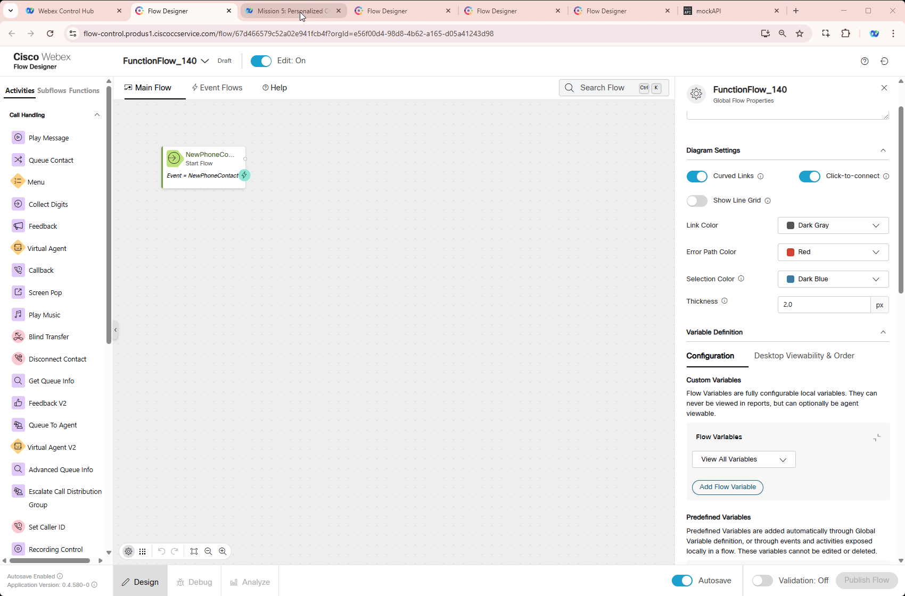

# Mission 5: Personalized Customer Notification with Functions


## Story 
The primary objective of this new feature is to enhance nodes activities to include a dynamic variable-based selection option to make your flow smaller and simpler to adjust. You will learn how to use **Dynamic Variables** in multiple nodes including **GoTo**, **Business Hours**, **Queue** and other nodes. 

## Call Flow Overview

1. When call arrives fetch the data from **MockAPI** based on your Dialed Number.</br>
2. Write the data into respective preconfigured flow variables. These variables will be passed to a Function.</br>
3. Function will generate a message based on inputs and pass it back to your flow.</br>
4. Play Message node plays the message received from Function.</br>


## Mission Details

Your mission is to:
1. Create a function that retrieves input variables, processes them, and generates a customer-friendly message.</br>
2. Create a new flow with the Function element.</br>
3. Request data from an external database, parse it into flow variables, and pass them to your Function.</br>
4. Play the message generated by the Function to the caller.</br>

> **<details><summary>Good to Know <span style="color: orange;">[Optional]</span></summary>**
>
> We are going to imitate a real API server by providing realistic responses to requests. For that we chose Server [**MockAPI**](https://mockapi.io/){:target="_blank"}.
> 
> For more information of how you can use MockAPI please watch these Vidcasts: 
[**[ADVANCED] Use MockAPI to enhance your Demos - PART 1**](https://app.vidcast.io/share/ce058b71-109e-4929-b9ca-46b83d94f7e3){:target="_blank"} and [**[ADVANCED] Use MockAPI to enhance your Demos - PART 2**](https://app.vidcast.io/share/1e259a34-7e9e-44d9-aa5a-5d76e07256a3){:target="_blank"}
> 
> </details>


## Building Function 

1. Switch to Control Hub, then navigate to **Functions**, click on **Create a function** then select **Create a function** from drop down list. 

2. New Tab will be opened. Select **Start Fresh** and provide name **<span class="attendee-id-container">Function_<span class="attendee-id-placeholder" data-prefix="Function_">Your_Attendee_ID</span><span class="copy" title="Click to copy!"></span></span>** then click **Create Function**.

    

3. Switch Read-Only mode from **Off** to **On** and add following variables by clicking **Add Input Variables**:


 
    - Last purchase date variable:
    
      >
      > Name: **lastPurchase**<span class="copy-static" data-copy-text="lastPurchase"><span class="copy" title="Click to copy!"></span></span>
      >
      > Type: **String**
      >
      > Default Value: *empty*
      >
      > Variable Value: *put space character*

    - Customer pending request variable:
    
      >
      > Name: **pendingServiceRequest**<span class="copy-static" data-copy-text="pendingServiceRequest"><span class="copy" title="Click to copy!"></span></span>
      >
      > Type: **String**
      >
      > Default Value: *empty*
      >
      > Variable Value: *put space character*

    - Expected resolution date variable:
    
      >
      > Name: **resolutionDate**<span class="copy-static" data-copy-text="resolutionDate"><span class="copy" title="Click to copy!"></span></span>
      >
      > Type: **String**
      >
      > Default Value: *empty*
      >
      > Variable Value: *put space character*

    - Outstanding account balance variable:
    
      >
      > Name: **outstandingBalance**<span class="copy-static" data-copy-text="outstandingBalance"><span class="copy" title="Click to copy!"></span></span>
      >
      > Type: **String**
      >
      > Default Value: *empty*
      >
      > Variable Value: *put space character*

4. Add output variable **personalizedMessage**<span class="copy-static" data-copy-text="personalizedMessage"><span class="copy" title="Click to copy!"></span></span> in **Output Variable Definition** field.

    


5. Clear the editor from the default code and paste the following JavaScript code into Function editor.

    ``` JSON
     export const handle = async (request, response) => {
        // Retrieve input variables (all as strings)
        var lastPurchase = request.inputs.lastPurchase;  // e.g., '17-03-2025'
        var outstandingBalance = request.inputs.outstandingBalance;  // e.g., '120.50'
        var pendingServiceRequest = request.inputs.pendingServiceRequest;  // e.g., 'Network issue'
        var resolutionDate = request.inputs.resolutionDate;  // e.g., '20-03-2025'
    
        // Convert outstandingBalance to a number safely
        let balanceAmount = parseFloat(outstandingBalance);
        if (isNaN(balanceAmount)) {
            balanceAmount = 0;  // Default to 0 if conversion fails
        }
    
        // Function to convert 'DD-MM-YYYY' to a proper Date object
        function parseDate(dateString) {
            if (!dateString) return null;
            const parts = dateString.split('-'); // Split "17-03-2025" into ["17", "03", "2025"]
            if (parts.length !== 3) return null; // Invalid format
    
            const [day, month, year] = parts.map(num => parseInt(num, 10));
            return new Date(year, month - 1, day); // Month is 0-based in JS Dates
        }
    
        // Format the date to a readable string (e.g., "March 17, 2025")
        function formatDate(date) {
            return date ? date.toLocaleDateString('en-US', { year: 'numeric', month: 'long', day: 'numeric' }) : null;
        }
    
        // Parse and format dates
        let formattedLastPurchase = formatDate(parseDate(lastPurchase));
        let formattedResolutionDate = formatDate(parseDate(resolutionDate));
    
        // Generate the personalized message
        let message = 'Hello, we have some information about your account:';
    
        if (formattedLastPurchase) {
            message += ` Your last purchase was on ${formattedLastPurchase}.`;
        }
        if (balanceAmount > 0) {
            message += ` You have an outstanding balance of $${balanceAmount.toFixed(2)}.`;
        }
        if (pendingServiceRequest) {
            message += ` We also have a pending service request: ${pendingServiceRequest}`;
            if (formattedResolutionDate) {
                message += `, resolution by ${formattedResolutionDate}.`;
            } else {
                message += `.`;
            }
        } else {
            message += ' There are no pending service requests at the moment.';
        }
    
        // Return the generated message
        response.data = { 'personalizedMessage': message };
    
        return response;
        };
    ```

    

    > **<details><summary>Good to know: Script Breakdown<span style="color: orange;">[Optional]</span></summary>**
    >
    > This script dynamically generates a personalized message for customers based on their account details. In our lab it is a Channel Support Number assigned to you. It is used within Webex Contact Center (WxCC) Flow Designer to enhance customer interactions.
    > 
    > 1. How It Works:
    > Retrieves input variables from the Flow:
    > 
    >> `lastPurchase` → Date of the last purchase (e.g., `"17-03-2025"`).
    >> `outstandingBalance` → The amount owed by the customer (e.g., `"120.50"`).
    >> `pendingServiceRequest` → Details of any unresolved service request (e.g., `"Network issue"`).
    >> `resolutionDate` → Expected resolution date of the service request (e.g., `"20-03-2025"`).
    > 
    > 2. Processes and formats the data:
    >
    >> Converts `lastPurchase` and `resolutionDate` from `"DD-MM-YYYY"` format into a more readable format (`March 17, 2025`).
    >>
    >> Ensures `outstandingBalance` is a valid number and avoids errors if it’s missing or invalid.
    >
    > 3. Generates a customer-friendly message:
    >
    >> If the customer made a purchase, the date is included.
    >>
    >> If an outstanding balance exists, the amount is shown.
    >>
    >> If there’s a pending service request, it’s mentioned, along with a resolution date (if available).
    >>
    >> If no pending issues exist, it confirms that everything is fine.
    >
    > 4. Returns the message to be used in the Flow:
    >
    >> The script outputs `personalizedMessage`, which can be read out in an IVR or displayed to an agent.
    >>
    >
    ></details>

7. Perform a test to see how you script preforms by clicking on **Test** pannel below the editor. Provide following date into respective fields. Then click **Test** button.

    > `lastPurchase`: **17-03-2025**<span class="copy-static" data-copy-text="17-03-2025"><span class="copy" title="Click to copy!"></span></span>
    >
    > `pendingServiceRequest`: **Network issue on Amsterdam location**<span class="copy-static" data-copy-text="Network issue on Amsterdam location"><span class="copy" title="Click to copy!"></span></span>
    >
    > `resolutionDate`: **20-03-2025**<span class="copy-static" data-copy-text="20-03-2025"><span class="copy" title="Click to copy!"></span></span>
    >
    > `outstandingBalance`: **529.51**<span class="copy-static" data-copy-text="529.51"><span class="copy" title="Click to copy!"></span></span>
    >

8. Click on **Publish Function** and again click **Publish Function** in pop up window.

    

---

## Building Flow

1. Switch to Control Hub, then navigate to **Flows**, click on **Manage Flows** then select **Create Flows** from drop down list. 

2. Select **Start Fresh** then enter flow name **<span class="attendee-id-container">FunctionFlow_<span class="attendee-id-placeholder" data-prefix="FunctionFlow_">Your_Attendee_ID</span><span class="copy" title="Click to copy!"></span></span>**. Click on **Create Flow**.

    


3. Add these flow variables:
  
    - Last purchase date variable:
    
      >
      > Name: **lastPurchase**<span class="copy-static" data-copy-text="lastPurchase"><span class="copy" title="Click to copy!"></span></span>
      >
      > Type: **String**
      >
      > Default Value: *empty*

    - Customer pending request variable:
    
      >
      > Name: **pendingServiceRequest**<span class="copy-static" data-copy-text="pendingServiceRequest"><span class="copy" title="Click to copy!"></span></span>
      >
      > Type: **String**
      >
      > Default Value: *empty*

    - Expected resolution date variable:
    
      >
      > Name: **resolutionDate**<span class="copy-static" data-copy-text="resolutionDate"><span class="copy" title="Click to copy!"></span></span>
      >
      > Type: **String**
      >
      > Default Value: *empty*

    - Outstanding account balance variable:
    
      >
      > Name: **outstandingBalance**<span class="copy-static" data-copy-text="outstandingBalance"><span class="copy" title="Click to copy!"></span></span>
      >
      > Type: **String**
      >
      > Default Value: *empty*


    - HTTP Response variable:
    
      >
      > Name: **HTTPResponse**<span class="copy-static" data-copy-text="HTTPResponse"><span class="copy" title="Click to copy!"></span></span>
      >
      > Type: **String**
      >
      > Default Value: *empty*

    - Personalized message variable:
    
      >
      > Name: **personalizedMessage**<span class="copy-static" data-copy-text="personalizedMessage"><span class="copy" title="Click to copy!"></span></span>
      >
      > Type: **String**
      >
      > Default Value: *empty*

    


    > **<details><summary>**Test your API Source**<span style="color: orange;">[Optional]</span></summary>**
    > 
    > 1. Test your API resource. **https://674481b1b4e2e04abea27c6e.mockapi.io/flowdesigner/Lab/DynVars?dn={DNIS}**<span class="copy-static" data-copy-text="https://674481b1b4e2e04abea27c6e.mockapi.io/flowdesigner/Lab/DynVars?dn={DNIS}"><span class="copy" title="Click to copy!"></span></span>
    > 
    > 2. Replace DNIS with the provided DNIS number stripping +1
    >
    > <span style="color: orange;">[Example:]</span> If your number **+14694096861**, then your GET Query should be ***https://674481b1b4e2e04abea27c6e.mockapi.io/flowdesigner/Lab/DynVars?dn=4694096861***
    >
    > 3. Open Chrome browser and past your URL. You should get the follwoing result
    > 
    > 
    > 
    > 4. Test JSON Path in the following tool [https://jsonpath.com/](https://jsonpath.com/){:target="_blank"}
    > 
    > 5. Paste your GET URL into the Browser address line and copy the output in square brackets (including brackets)
    >
    > 6. Open [https://jsonpath.com/](https://jsonpath.com/){:target="_blank"} and paste the copied response into **Inputs** window
    >
    > 7. In **JSONPath** box copy and paste one of the path expression from **FetchFlowSettings** to verify your results.
    >
    > 
    > </details>


6. Add an **HTTP Request** node. We are going to fetch data and write it into our new created variables `lastPurchase`, `pendingServiceRequest`, `resolutionDate` and `outstandingBalance`.
    
    >
    > Connect **NewPhoneContact** Option 3 to this HTTP node
    >
    > We will connct **HTTP Request** node in next step
    >
    > Activity Name: **GET_HTTPRequest**<span class="copy-static" data-copy-text="GET_HTTPRequest"><span class="copy" title="Click to copy!"></span></span>
    >
    > Use Authenticated Endpoint: **Off**
    >
    > Requestt URL: ***https://674481b1b4e2e04abea27c6e.mockapi.io/flowdesigner/Lab/DynVars?dn={{NewPhoneContact.DNIS | slice(2) }}***<span class="copy-static" data-copy-text="https://674481b1b4e2e04abea27c6e.mockapi.io/flowdesigner/Lab/DynVars?dn={{NewPhoneContact.DNIS | slice(2) }}"><span class="copy" title="Click to copy!"></span></span>
    > 
    > Method: **GET**
    > 
    > Content Type: **Application/JSON**
    >
    > **Parsing Settings:**
    >
    > Content Type: **JSON** 
    >
    > Output Variable: **`pendingServiceRequest`**<span class="copy-static" data-copy-text="pendingServiceRequest"><span class="copy" title="Click to copy!"></span></span>
    >
    > Path Expression: **`$[0].pendingServiceReques`t**<span class="copy-static" data-copy-text="$[0].pendingServiceRequest"><span class="copy" title="Click to copy!"></span></span>
    >
    > Click **Add New**
    >
    > Output Variable: **`lastPurchase`**<span class="copy-static" data-copy-text="lastPurchase"><span class="copy" title="Click to copy!"></span></span>
    >
    > Path Expression: **`$[0].lastPurchase`r**<span class="copy-static" data-copy-text="$[0].lastPurchase"><span class="copy" title="Click to copy!"></span></span>
    >
    > Click **Add New**
    >
    > Output Variable: **`outstandingBalance`**<span class="copy-static" data-copy-text="outstandingBalance"><span class="copy" title="Click to copy!"></span></span>
    >
    > Path Expression: **`$[0].outstandingBalance`r**<span class="copy-static" data-copy-text="$[0].outstandingBalance"><span class="copy" title="Click to copy!"></span></span>
    >
    > Click **Add New**
    >
    > Output Variable: **`resolutionDate`**<span class="copy-static" data-copy-text="resolutionDate"><span class="copy" title="Click to copy!"></span></span>
    >
    > Path Expression: **`$[0].resolutionDate`r**<span class="copy-static" data-copy-text="$[0].resolutionDate"><span class="copy" title="Click to copy!"></span></span>


4. Add **Set Variable** node
    
    >
    > Activity Label: **HTTP_Response**<span class="copy-static" data-copy-text="HTTP_Response"><span class="copy" title="Click to copy!"></span></span>
    >
    > Connect **GET_HTTPRequest** to this node
    >
    > We will connct **Set Variable** node in next step
    >
    > Variable: **HTTPResponse**<span class="copy-static" data-copy-text="HTTPResponse"><span class="copy" title="Click to copy!"></span></span>
    >
    > Set To Variable: **GET_HTTPRequest.httpResponseBody**<span class="copy-static" data-copy-text="GET_HTTPRequest.httpResponseBody"><span class="copy" title="Click to copy!"></span></span>
    >


5. Switch to **Functions** in the left menu. Then drag **<span class="attendee-id-container">FunctionFlow_<span class="attendee-id-placeholder" data-prefix="FunctionFlow_">Your_Attendee_ID</span><span class="copy" title="Click to copy!"></span></span>** node to the canvas.
    >
    > Connect **GET_HTTPRequest** to this node
    >
    > We will connct **Set Variable** node in next step


8. Open a **Queue** Node and set **Fallback Queue** to **CCBU_Fallback_Queue**. That is needed to make sure the call will find an end queue in case API GET call fails.

9. Open **GoTo_x19** node and set:

    > Destination Type: **Flow**
    >
    > Static Flow
    >
    > Flow: **CLTS_ErrorHandling_Flow**
    >
    > Choose Version Label: **Latest**
    
10. Open **GoTo_8ca** and set:

    > Destination Type: **Entry Point**
    >
    > Static Entry Point
    >
    > Entry Point: **CLTS_ErrorHandling_Channel**

 
11. Repeat node settings in **Step 9** for **GoTo_uyn**

12. Repeat node settings in **Step 10** for **GoTo_dbr**

    

13. **Validate** and **Publish** flow

14. In Popped up window click on dropdown menu to select **Latest** label, then click **Publish**

15. Switch to Control Hub and navigate to **Channels** under Customer Experience Section
    
    > 
    > Locate your Inbound Channel (you can use the search):  **<span class="attendee-id-container"><span class="attendee-id-placeholder" data-suffix="_Channel">Your_Attendee_ID</span>_Channel<span class="copy" title="Click to copy!"></span></span>**
    > 
    > Select the Routing Flow: **<span class="attendee-id-container">DynamicVariables_<span class="attendee-id-placeholder" data-prefix="DynamicVariables_">Your_Attendee_ID</span><span class="copy" title="Click to copy!"></span></span>**
    > 
    > Select the Version Label: **Latest**
    > 
    > Click **Save** in the lower right corner of the screen

    


## Testing

1. Your Agent desktop session should be still active but if not, use Webex CC Desktop application  and login with agent credentials you have been provided **<span class="attendee-id-container">wxcclabs+agent_ID<span class="attendee-id-placeholder" data-prefix="wxcclabs+agent_ID" data-suffix="@gmail.com">Your_Attendee_ID</span>@gmail.com<span class="copy" title="Click to copy!"></span></span>**. You will see another login screen with OKTA on it where you may need to enter the email address again and the password provided to you. 

2. Select Team **<span class="attendee-id-placeholder">Your_Attendee_ID</span>_Team**. Click **Submit**. Allow browser to access Microphone by clicking **Allow** on ever visit.

3. Make your agent ***Available*** and you're ready to make a call.

    

4. Change the status of your agent to **Available** and make a call to test you flow. If everyhing configured as per instructions you should hear a **welcome1** message that is a value of ***$[0].welcomePrompt1*** and then ***$[0].welcomePrompt2***. Finally the call should land on the ***$[0].queue***

### <span style="color: orange;">[Optional]</span> Test other variables

5. You can do the same trick we did in Mission 2 of Core Track and use **Override** option to change the logic. Overrides as well as Business hours have been preconfigured for you. Now we need to apply it on your **<span class="attendee-id-container"><span class="attendee-id-placeholder" data-suffix="_Bussiness_Hours">Your_Attendee_ID</span>_Bussiness_Hours<span class="copy" title="Click to copy!"></span></span>** entity. Open **<span class="attendee-id-placeholder">Your_Attendee_ID</span>_Bussiness_Hours** in **Control Hub**, scroll down to Additional Settings and select **Overrides_Hours** from Override dropdown list. Then click Save.
    
    !!! Note
        Override Hours entity overwrites Working Hours and set to duration of current Cisco Live lab 

    

6. Make a new call to be redirected to flow ***$[0].goToFlow*** where the following message can be heard: **"Thanks you for call. You are now on Error Handling flow and will be redirected to Global Support line in a moment. Good bye."**

7. Now we need to revert the configuration we made in Step 1. Open **<span class="attendee-id-placeholder">Your_Attendee_ID</span>_Bussiness_Hours** in **Control Hub** in **Control Hub**, scroll down to **Additional Settings** and select **None** from Override dropdown list. Then click **Save**.

    


<p style="text-align:center"><strong>Congratulations, you have succesfully completed Routing Facilitation mission! 🎉🎉 </strong></p>
